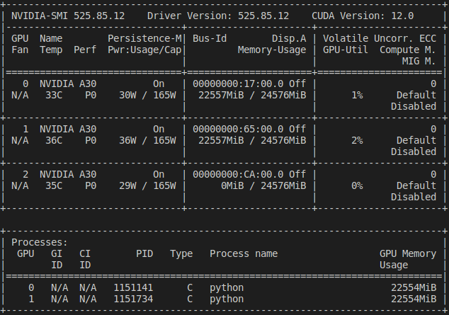

# EMSAssist
This repository currently contains the reproducible artifact for EMSAssist.

First of all, we create and activate a conda environment with tensorflow-gpu: `conda activate tf-gpu`

## Basic Environment

| Software Environment  | Version |
| ------------- | ------------- |
| OS  | Ubuntu Server 22.04.1 LTS |
| NVIDIA Driver  | 525.85.12  |

| Hardware Environment  | Version |
| ------------- | ------------- |
| GPU  | 3 x NVIDIA A30   |
| CPU | 2 x Intel Xeon 4314 |

Before the artifact evaluation and use the open-sourced code/data, please make sure you have at least 1 NVIDIA GPU available with `nvidia-smi` command.



## Build the target Environment

| Software Environment  | Version |
| ------------- | ------------- |
| OS  | Ubuntu Server 22.04.1 LTS |
| NVIDIA Driver  | 525.85.12  |
| CUDA Version  | 10   |
| TensorFlow  | 2.9   |


```
conda create -n xgb-gpu
conda activate xgb-gpu
conda install python=3.7
conda install py-xgboost-gpu
pip install tensorflow-gpu==2.9
```

`conda install -c conda-forge py-xgboost-gpu`

`mv /home/liuyi/anaconda3/lib/libstdc++.so.6.0.29 /home/liuyi/anaconda3/lib/libstdc++.so.6.0.29.old`

`ln -s /home/liuyi/anaconda3/envs/tf-gpu/lib/libstdc++.so.6.0.30 /home/liuyi/anaconda3/lib/libstdc++.so.6.0.29`